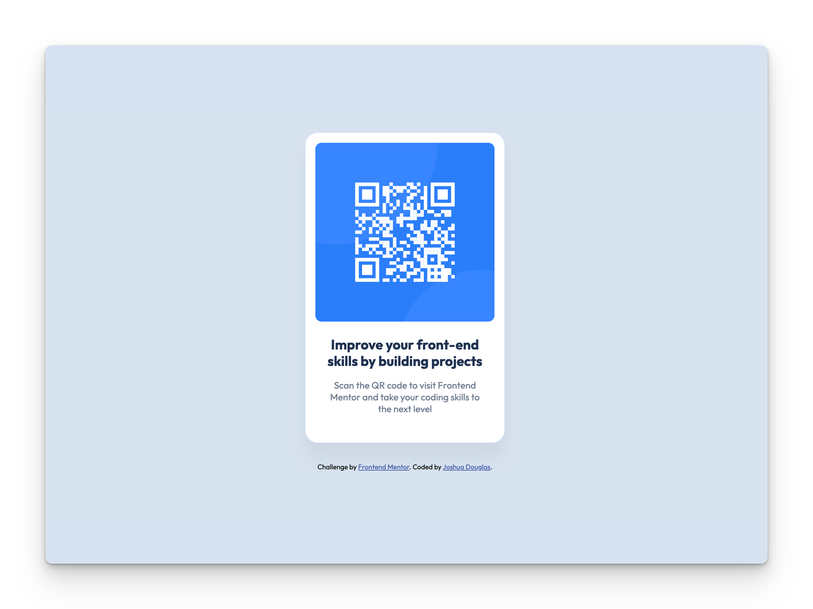

# Frontend Mentor - QR code component solution

This is a solution to the [QR code component challenge on Frontend Mentor](https://www.frontendmentor.io/challenges/qr-code-component-iux_sIO_H). Frontend Mentor challenges help you improve your coding skills by building realistic projects.

## Table of contents

- [Overview](#overview)
  - [Screenshot](#screenshot)
  - [Built with](#built-with)
- [Author](#author)

### Screenshot

### Built with

- Semantic HTML5 markup
- CSS custom properties
- Flexbox

### Further Development

Some hover effects and translations as the cursor moves over or near the card would make for a polished look. These are areas I will look at as my css skills improve.

### Author

- Github Repo - [QR Code Generator](https://github.com/joshuadouglas/QR-Code-Component)
- Frontend Mentor - [@joshuadouglas](https://www.frontendmentor.io/profile/joshuadouglas)
